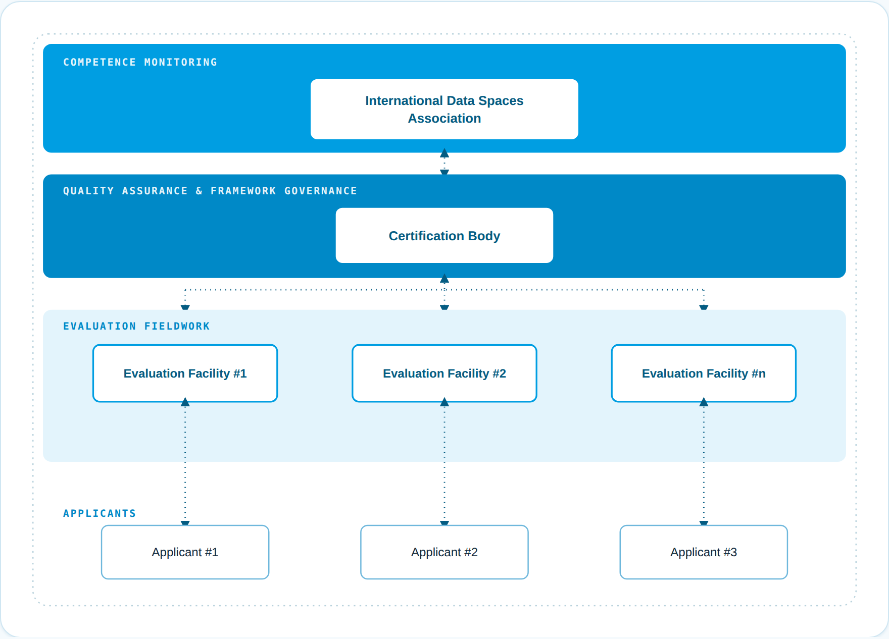

# Part 1 - Certification framework

Connectors shall provide a sufficiently high degree of security regarding the integrity, confidentiality and availability of information exchanged in the IDS. Therefore, an evaluation and certification of the connector is
mandatory for participating in and IDS-based data space.

This requirement for compliance necessitates the definition of a framework in order to ensure a consistent and comparable evaluation and certification process amongst all IDS connectors. Hence, a certification scheme has been defined following
best practices from other internationally accredited certifications.

All certification-related roles described in this paper are specific to the IDS, i.e. terms such as "Certification Body" should not be misunderstood to refer to an existing organization already granting certificates. As part of the scheme implementation
in 2018, the roles defined here will be assigned to actual organizations.

Figure 1: International Data Spaces Certification - Roles & Responsibilities

## International Data Spaces Association

The Industrial Data Space initially originated as a German research initiative. Nevertheless, the initiative driven forward by the International Data Spaces Association (IDSA) always had a wider scope
in mind, by addressing more and more international members and component developers, as the initiative keeps growing. 

The International Data Spaces Association appoints the IDS Certification Body.

Its responsibilities in the context of the certification scheme include:

-   Defining the requirements for the Certification Body and verification of the required technical competencies.

-   Monitoring of the Certification Body to ensure a consistent level of quality for the certification of connectors.

-   Monitoring of the current regulatory and legal requirements to evaluate and react to possible influences to the certification scheme.

-   Provisioning of recommendations to the Certification Body based on the results of its monitoring activities.

-   Continuous improvement of the defined certification scheme including the incorporation of the feedback provided by the Certification Body.

The IDSA is not actively involved in connector certifications and the approval of Evaluation Facilities for performing evaluations.

## Certification Body

The IDS Certification Body defines the standardized evaluation procedures and supervises the actions of the Evaluation Facilities.

Its responsibilities include:

-   Formulating and defining the certification scheme in cooperation with the WG Certification members, including the evaluation procedures, participant and core component certification approaches as well as their underlying criteria catalogues.

-   Ensuring correct implementation and execution of the IDS certification scheme, including the supervision of ongoing evaluations.

-   Ensuring continuous adherence to the IDS certification scheme following up on changes und updates received from the IDSA.

-   Analyzing existing "base" certificates (e.g. for software and hardware security components) to determine their validity and sufficiency, and deciding about their acceptance within the IDS certification scheme.

-   Reviewing and commenting on the evaluation reports received from Evaluation Facilities.

-   Approval of applications for certification.

-   Making final decision about the award or denial of a certificate and publishing the awarded certificates.

-   Decision about approval or exclusion of Evaluation Facilities for/from executing Industrial Data Space evaluations (based on ongoing monitoring and [CRIT-EF]).

-   Ongoing monitoring of certification-relevant external developments (e.g. new attack patterns which might circumvent certified security measures).

-   Providing input based on the practical quality assurance experiences to future updates of the IDS certification scheme to the International Data Spaces Association.

The Certification Body only grants the certificate (called evaluation certificate subsequently) only if both the Evaluation Facility and the experts of the Certification Body have come to the conclusion that all preconditions are fulfilled.

## Evaluation Facility

An Evaluation Facility is contracted by an Applicant and is as such responsible for carrying out the detailed technical evaluation work during a certification. The Evaluation Facility issues an evaluation report for the connector, listing details regarding the performed evaluation actions as well as information regarding the confirmed Module.

The responsibilities of the Evaluation Facility include:

-   Obtaining approval by the Certification Body to perform evaluations, based on an approval process with criteria defining personnel competencies and organizational requirements [CRIT-EF].

-   Applying the criteria specified in the IDS certification scheme according to generally accepted standards and best practices (including the execution of any necessary tests and checks).

-   Documenting the results in an evaluation report.

-   Providing the evaluation report to the Certification Body.

The term Evaluation Facility is used throughout the document to refer to approved evaluators for
connector evaluations. Hence, multiple approved Evaluation Facilities exist in the IDS certification scheme, but in each evaluation only one Evaluation Facility will be involved.

## Applicant

The Applicant plays an active part in the certification process. As such, the responsibilities of the respective organization include:

-   Contract an approved (by the Certification Body) Evaluation Facility to carry out the evaluation according to the IDS certification scheme.

-   Formally apply for certification (with the Certification Body) in order to trigger the start of the certification process.

-   Provide the necessary resources in terms of financing and personnel.

-   Communicate swiftly with and provide all necessary information and evidence to the Evaluation Facility and the Certification Body.

-   React adequately to findings occurring during the course of the evaluation.

All Applicants need to actively submit an application to start the certification process and have the duties as listed above. 

## Issuance of Certificates

After a successfully completed evaluation, the Certification Body awards an IDS evaluation certificate to the applicant. These certificates have a validity period of 2 years.
Renewal of a certificate after its expiration is not foreseen under the current certification scheme.
Change certification is required if changes are made to the target of certification as described in the Rules of Procedure. 
